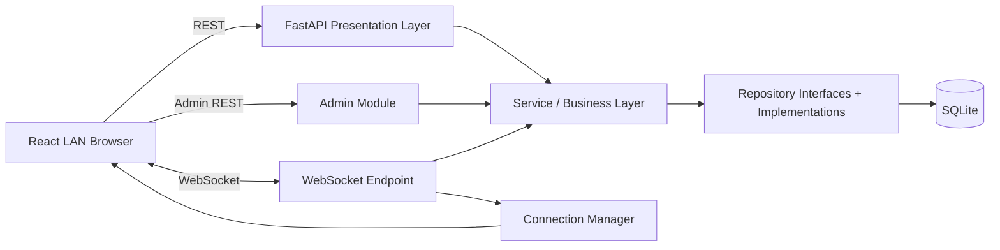
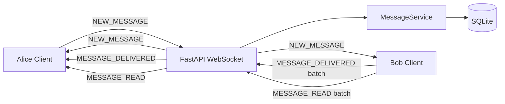
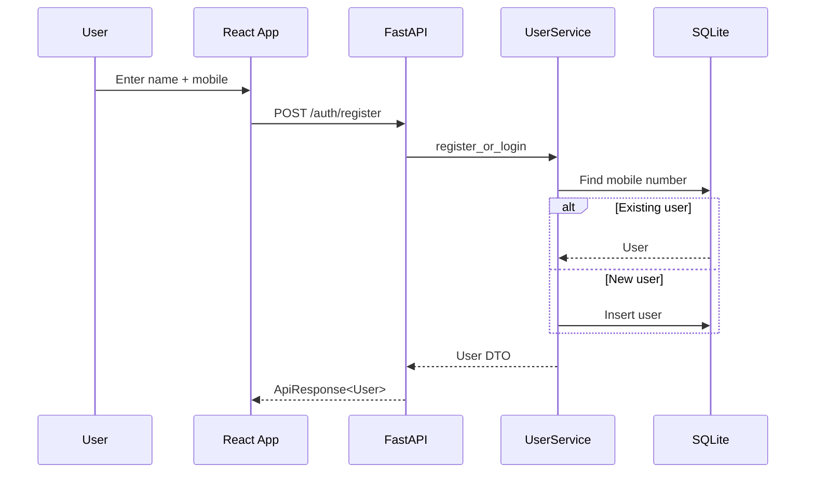
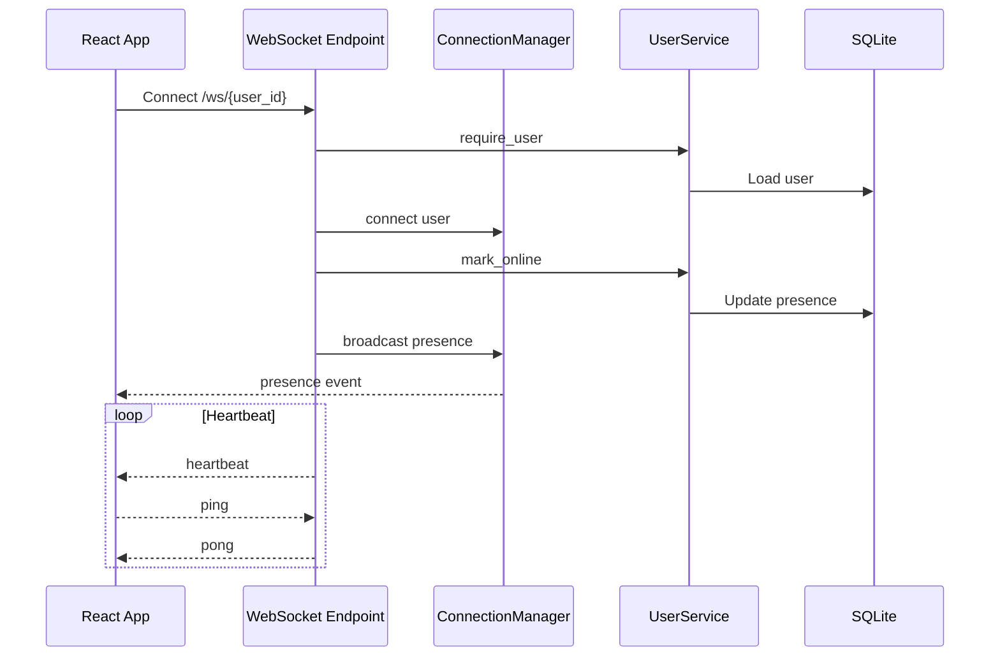
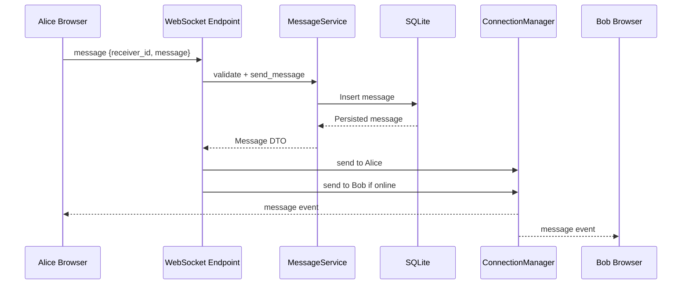
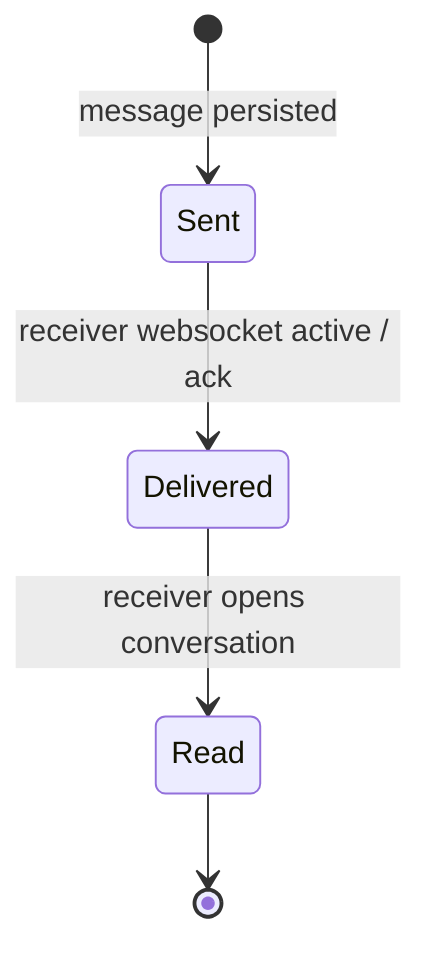
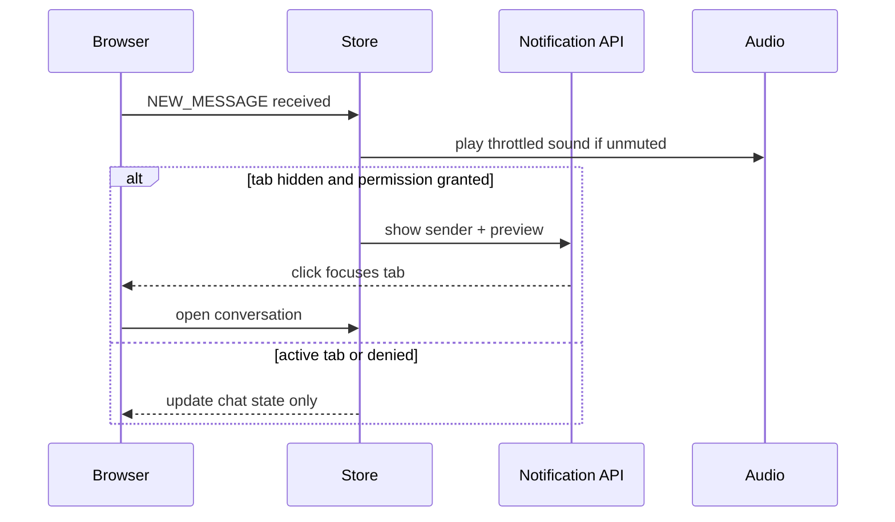

# LAN Chat

A lightweight real-time local network chat app for users on the same WiFi/LAN. Users register with a name and mobile number, see live presence, and exchange persistent one-to-one text messages.


## Features

- Local register/login with unique mobile numbers.
- FastAPI REST APIs plus native WebSocket realtime messaging.
- Online/offline presence with `connected_at` and `last_seen`.
- Persistent SQLite users and messages.
- React + Vite + TypeScript dark-mode dashboard.
- Clean backend layering: presentation, service, repository, database, models, schemas, utilities, WebSocket manager.
- LAN-ready defaults: backend binds to `0.0.0.0`, Vite serves on `0.0.0.0`.
- Basic HTTP rate limiting, input sanitization, structured responses, logging, heartbeat events, and graceful shutdown.
- Admin console at `/admin` with token-based admin login, user create/edit/delete, disable/enable, search, online state, and message counts.
- Message lifecycle indicators: sent, delivered, and read.
- Emoji picker, Unicode emoji storage, message replies, reply preview, and click-to-original behavior.
- Sound notifications, browser notifications, mute setting, and persisted notification preferences.
- Responsive Teams-style UI with mobile sidebar, avatars, modern bubbles, sticky composer, and paginated history.
- Dark/light theme toggle with persisted preference and vibrant semantic design tokens.
- Polished high-contrast message bubbles, visible ticks, glowing presence indicators, and mobile-safe layout.

## Architecture



## Component Interaction

```mermaid
flowchart TB
  AuthRoute[/POST /auth/register/] --> UserService
  UsersRoute[/GET /users/] --> UserService
  MessagesRoute[/GET /messages/{user_id}/] --> MessageService
  WebSocketRoute[/ws/{user_id}/] --> MessageService
  AdminRoute[/admin/*/] --> AdminAuthService
  AdminRoute --> UserService
  AdminRoute --> MessageService
  WebSocketRoute --> UserService
  WebSocketRoute --> ConnectionManager
  UserService --> UserRepository
  MessageService --> MessageRepository
  MessageService --> UserRepository
  UserRepository --> SQLite[(users)]
  MessageRepository --> SQLiteMessages[(messages)]
```

## WebSocket Event Flow



## Sequence Diagrams

### User Login



### WebSocket Connection



### Sending Message



### Message Lifecycle



### Notification Flow



## Folder Structure

```text
.
├── backend
│   ├── app
│   │   ├── core
│   │   ├── database
│   │   ├── models
│   │   ├── presentation/routes
│   │   ├── repositories
│   │   ├── schemas
│   │   ├── services
│   │   ├── utilities
│   │   └── websocket
│   ├── requirements.txt
│   └── run.py
├── frontend
│   ├── src
│   │   ├── api
│   │   ├── components
│   │   ├── store
│   │   ├── types
│   │   └── utils
│   └── package.json
├── scripts/start.sh
└── Makefile
```

## Setup Instructions

Prerequisites:

- Python 3.12+
- Node.js 20+
- npm

If `make run` prints `npm: command not found`, install Node.js 20+ first. On Ubuntu/Debian, one option is:

```bash
curl -fsSL https://deb.nodesource.com/setup_20.x | sudo -E bash -
sudo apt-get install -y nodejs
node --version
npm --version
```

With `nvm`:

```bash
curl -o- https://raw.githubusercontent.com/nvm-sh/nvm/v0.40.3/install.sh | bash
nvm install 20
nvm use 20
node --version
npm --version
```

One-command setup and run:

```bash
make run
```

Backend-only run while Node.js is being installed:

```bash
make backend
```

Manual setup:

```bash
cp backend/.env.example backend/.env
cp frontend/.env.example frontend/.env
make setup
```

## Admin Usage

Configure admin credentials in `backend/.env`:

```bash
ADMIN_USERNAME=admin
ADMIN_PASSWORD=change-me-admin
ADMIN_TOKEN_SECRET=replace-with-a-local-secret
ADMIN_TOKEN_TTL_MINUTES=480
```

Open:

```text
http://localhost:5173/admin
```

The admin console supports:

- Create users.
- Edit name, mobile number, and enabled state.
- Delete users after confirmation.
- Search/filter users.
- View online/offline status, last seen, created date, and total message count.

For LAN access:

```text
http://HOST_LAN_IP:5173/admin
```

## Backend Setup

```bash
cd backend
python3.12 -m venv .venv
. .venv/bin/activate
pip install -r requirements.txt
python run.py
```

Backend URL:

```text
http://0.0.0.0:8000
```

Health check:

```bash
curl http://localhost:8000/health
```

Show LAN details:

```bash
cd backend
.venv/bin/python -m app.utilities.show_network
```

## Frontend Setup

```bash
cd frontend
npm install
npm run dev -- --host 0.0.0.0
```

Frontend URL:

```text
http://localhost:5173
```

For another backend host, set:

```bash
VITE_API_BASE_URL=http://YOUR_LAN_IP:8000
```

## LAN Access Instructions

1. Connect all devices to the same WiFi/LAN.
2. Start the app on the host machine with `make run`.
3. Find the host LAN IP from startup logs or:

```bash
cd backend && .venv/bin/python -m app.utilities.show_network
```

4. On another device, open:

```text
http://HOST_LAN_IP:5173
```

5. Register two users from two browsers/devices and select each other in the sidebar.

If a firewall is enabled, allow inbound TCP ports `8000` and `5173`.

## API Examples

Register or login:

```bash
curl -X POST http://localhost:8000/auth/register \
  -H "Content-Type: application/json" \
  -d '{"name":"Alice","mobile_number":"+919876543210"}'
```

List users:

```bash
curl http://localhost:8000/users
```

Load messages with user `2` as current user `1`:

```bash
curl http://localhost:8000/messages/2 -H "X-User-Id: 1"
```

## WebSocket Flow

Connect:

```text
ws://localhost:8000/ws/1
```

Send message:

```json
{
  "type": "NEW_MESSAGE",
  "payload": {
    "receiver_id": 2,
    "message": "Hello from LAN",
    "reply_to_message_id": null
  }
}
```

Mark delivered:

```json
{
  "type": "MESSAGE_DELIVERED",
  "payload": {
    "message_ids": [101, 102]
  }
}
```

Mark read:

```json
{
  "type": "MESSAGE_READ",
  "payload": {
    "message_ids": [101, 102]
  }
}
```

Presence event:

```json
{
  "type": "USER_ONLINE",
  "payload": {
    "id": 1,
    "name": "Alice",
    "mobile_number": "+919876543210",
    "is_online": true,
    "last_seen": "2026-05-21T10:00:00Z",
    "connected_at": "2026-05-21T10:00:00Z",
    "created_at": "2026-05-21T09:55:00Z"
  }
}
```

Supported event names:

| Event | Direction | Purpose |
| --- | --- | --- |
| `PING` / `PONG` | Client/server | Keep connection alive |
| `HEARTBEAT` | Server to client | Server-side connection heartbeat |
| `USER_ONLINE` | Server to clients | Presence update |
| `USER_OFFLINE` | Server to clients | Presence update |
| `NEW_MESSAGE` | Both | Send and receive messages |
| `MESSAGE_DELIVERED` | Both | Batch delivery acknowledgement |
| `MESSAGE_READ` | Both | Batch read acknowledgement |
| `ERROR` | Server to client | Validation/runtime error |

## Notifications

The chat UI includes:

- Sound notification for incoming messages.
- Separate tone feel for active and background conversations.
- Throttling to avoid repeated spam sounds.
- Mute/unmute toggle persisted in browser storage.
- Browser Notification API support for inactive/minimized tabs.
- Debug logs for permission checks, event eligibility, notification firing, WebSocket events, and sound throttling.

Browsers require the user to grant notification permission. If permission is denied, chat still works and the app simply skips browser notifications.

Notification behavior:

- Notifications fire only for incoming messages where the receiver is the current user.
- Self messages never trigger browser notifications.
- Browser notifications fire only when the tab is inactive or minimized.
- Clicking a notification focuses the tab, opens the sender conversation, and scrolls to the latest message.
- Sound notifications respect the mute toggle and are throttled to avoid spam.

Permission states:

| Permission | Behavior |
| --- | --- |
| `granted` | Browser notifications can fire for inactive tabs |
| `default` | User has not decided; use the Browser notification button |
| `denied` | Browser blocks notifications; re-enable from site settings |
| `unsupported` | Browser does not support the Notification API |

Debugging notifications:

1. Open browser DevTools.
2. Check console logs prefixed with `[notifications]`, `[websocket]`, and `[sound]`.
3. Confirm the page is inactive/minimized when testing browser notifications.
4. Confirm the message is incoming, not sent by the current user.
5. Confirm browser permission is `granted`.

## Theme System

The frontend uses `ThemeProvider` and `useTheme` from:

```text
frontend/src/theme/ThemeProvider.tsx
```

Theme preference is persisted in `localStorage` under:

```text
lan-chat-theme
```

Supported themes:

- `dark`: neon cyberpunk-style dark theme.
- `light`: vibrant high-contrast light theme.

The theme toggle appears in the chat header/sidebar, login page, and admin console.

## Color Architecture

Colors are centralized as CSS variables in:

```text
frontend/src/styles.css
```

Semantic tokens include:

| Token | Purpose |
| --- | --- |
| `--bg` | App background |
| `--surface` | Panels and sidebar |
| `--surface-soft` | Hover and nested surfaces |
| `--border` | Borders and dividers |
| `--text` | Primary text |
| `--text-secondary` | Secondary text |
| `--text-muted` | Muted metadata |
| `--primary` | Primary accent |
| `--secondary` | Secondary accent |
| `--success` | Online/read state |
| `--danger` | Error/destructive state |
| `--bubble-out-*` | Sent message bubble |
| `--bubble-in-*` | Received message bubble |

Reusable classes such as `app-panel`, `input-control`, `primary-button`, `bubble-out`, and `bubble-in` consume these tokens so both themes remain readable.

## UI Customization

To customize the look, adjust only the CSS variables in `frontend/src/styles.css`. Components should keep using semantic classes rather than hardcoded color utilities.

## Reply Feature

Each message has a reply action. Replies store `reply_to_message_id` in SQLite and render a small quoted preview above the message body. Clicking the preview scrolls to the original message when it is loaded in the current conversation.

## Mobile Support

The UI is responsive:

- Sidebar collapses on mobile.
- Message input stays sticky at the bottom.
- Chat bubbles and action buttons are touch-friendly.
- History can be loaded incrementally.

## Database Design

### `users`

| Column | Type | Notes |
| --- | --- | --- |
| `id` | integer | Primary key |
| `name` | string | Sanitized display name |
| `mobile_number` | string | Unique, indexed |
| `is_online` | boolean | Current presence |
| `is_active` | boolean | Admin enable/disable flag |
| `last_seen` | datetime | Updated on connect/disconnect |
| `connected_at` | datetime | Last successful connection |
| `created_at` | datetime | Creation timestamp |

### `messages`

| Column | Type | Notes |
| --- | --- | --- |
| `id` | integer | Primary key |
| `sender_id` | integer | FK to `users.id` |
| `receiver_id` | integer | FK to `users.id` |
| `message` | text | Sanitized plain text |
| `reply_to_message_id` | integer | Nullable FK to `messages.id` |
| `status` | string | `sent`, `delivered`, or `read` |
| `delivered_at` | datetime | Delivery acknowledgement timestamp |
| `read_at` | datetime | Read acknowledgement timestamp |
| `created_at` | datetime | Send timestamp |

Indexes:

- `users.mobile_number`
- `messages.sender_id`
- `messages.receiver_id`
- `messages(sender_id, receiver_id, created_at)`
- `messages.reply_to_message_id`

## Tradeoffs

- Passwords and auth tokens are intentionally omitted for frictionless LAN use.
- SQLite keeps setup simple. For high concurrency, use PostgreSQL.
- Presence is process-local in the WebSocket manager. Multiple backend instances would need Redis or another shared presence bus.
- Tables are created automatically at startup instead of using Alembic migrations to keep local onboarding simple.

## Future Improvements

- Alembic migrations for schema evolution.
- Optional JWT or device PIN for stronger identity.
- Message search and pagination.
- Redis-backed WebSocket fanout for multi-process deployment.
- Rich admin audit logs.
- Optional typing indicator using the existing event structure.

## Verification

Run two browsers or two devices on the same WiFi:

1. Start backend: `cd backend && .venv/bin/python run.py`
2. Start frontend: `cd frontend && npm run dev -- --host 0.0.0.0`
3. Open `http://HOST_LAN_IP:5173` on both devices.
4. Register two different mobile numbers.
5. Confirm both users appear online.
6. Send a message from each side.
7. Confirm sent, delivered, and read indicators update.
8. Reply to a message and confirm the preview scrolls to the original.
9. Open `/admin`, log in, and verify user management.
10. Enable browser notifications, switch tabs, and confirm incoming message notification.
11. Restart the app and confirm message history reloads.
